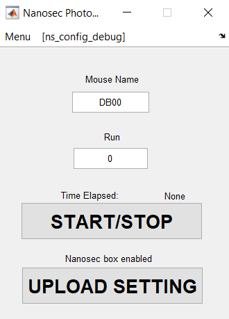
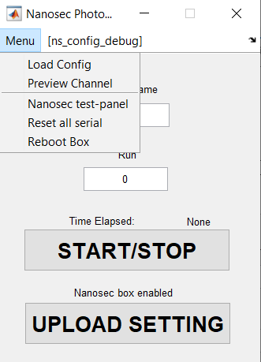

# I just received a Nanosec box. What do I do?

## 0. What did I get?
Below are items that you may have received. This guide mostly covers the nanosec box and tester. Please refer to the pages of the other components for details.

  1. A nanosec box (with teensy 4.0 in the center). Hardware details are [here](https://github.com/xzhang03/NidaqGUI/tree/master/PCBs/Nanosec)
  2. A nanosec tester. This is a gadget that is functionally equivalent to a nanosec box but doesn't have any BNC connectors or audio jacks. It is meant to test the config files and timings before deploying to your photometry rigs. It uses on-PCB LEDS to indicate when each digital pulse is sent out and uses buttons to mimic natural inputs (e.g., licking). Hardware details are [here](https://github.com/xzhang03/TeensyTester). Some pins are changed when compiling the code for a tester (see Section 4 below).
  3. Rotary encoder. Hardware details are [here](https://github.com/xzhang03/NidaqGUI/tree/master/PCBs/Rotary%20Encoder).
  4. Shifter. A box that enables multiplexing up to 6 channels of photometry/optogenetics control. Hardware details are [here](https://github.com/xzhang03/NidaqGUI/tree/master/PCBs/Shifter).
  5. DIO expander. A box that enables multiple trial types of behavior experiments. Hardware details are [here](https://github.com/xzhang03/NidaqGUI/tree/master/PCBs/DIO%20expander).
  6. RGB cue module. A 256-color module to enable LED as cues for behaviors. Hardware details are [here](https://github.com/xzhang03/NidaqGUI/tree/master/PCBs/LED%20cue%20i2c).
  7. I2C repeater. A module that enables longer cable lengths and component counts on the I2C bus. Hardware details are [here](https://github.com/xzhang03/NidaqGUI/tree/master/PCBs/I2C%20repeater).
  8. (Retired) [Buzzer](https://github.com/xzhang03/NidaqGUI/tree/master/PCBs/Buzzer).
  9. (Retired) [Non-i2c LED cue](https://github.com/xzhang03/NidaqGUI/tree/master/PCBs/LED%20cue).
  
  
## 1. How do I know my Nanosec box or tester is working?
### 1. Nanosec box
  1. Before testing, please make sure that, in the center of the PCB, "I2C=3V" and "BUFOUT=3V" are bridged. You can move the jumpers to 5V once you are familiar with the system. You can use **only 1 jumper per side**.
  2. When you plug in the micro USB on teensy, you should be able to record **6 ms, 50 Hz pulses** on both Ch1 and Ch2 BNCs. This is the default two-color photometry mode. Seeing the pulses does not mean your firmware vesion is up-to-date but it has some firmware there.
### 2. Nanosec tester
  1. When you plug in the micro USB on teensy, you should be able to see LED 2 and 3 blinking at **6 ms, 50 Hz pulses** each. This is the default two-color photometry mode. Seeing the pulses does not mean your firmware vesion is up-to-date but it has some firmware there.
  
## 2. Installing Nanosec software
  1. Clone the repo to your MATLAB path of interest. Do not add any folder to MATLAB path yet.
  2. Navigate to the main folder, and run the following function. You can run it section-by-section if you'd like.
	  ```MATLAB
	  nanosec_setup();
	  ```
  3. Please note the expected **firmware version (e.g., v3.5)**.
  4. Choose no on "Use PicoDAQ?" if you do not have one.
  5. If you see this message "Matlab is old. Please copy 'nanosecfun\old' to overwrite 'nanosecfun'." That means you are using an early version of Matlab, which requires different functions. Please copy the files and overwrite as instructed. You can do this after finishing running nanosec_setup(). The folder "nanosecfun\old" should never be in MATLAB paths.
  6. The program will add the appropriate folders to MATLAB paths. When you see "Nanosec settings saved", this step has been successfully completed.
  
## 3. COMs and firmwares
### 1. Get COMs
Each serial hardware has a COM that is assigned by the computer. It generally doesn't change if you unplug it and plug it back in. To get the COM port of your Nanosec and tester, plug them in and run:
```MATLAB
arduinoList()
```
If you see nothing, check that the USB cable is usable and plugged in correctly. You do not need proper firmware to be assigned a COM port. If you see multiple COMs, unplug your Nanosec/tester and run the command again. Whichever COM port has disappeared is the correct one.

### 2. Get onboard firmware versions
Once you know the COM number (say "COM22"), run nanosecver(com) like below:
```matlab
nanosecver('COM22');
```
You should hear back a string of text such as
 >Nanosec firmware version: v3.50PA498 Mar 27 2023 15:38:25.

Here is how to parse the message:
  1. 'v3.50' is the version, which should match the expected version above in Section 2.
  2. 'P' means PCB nanosec. If you use a tester, it should say 'T'. 'P' and 'T' versions differ in Pin assignments and should match the PCBs.
  3. 'A' means a debug firmware. If you see anything else, you will need to reflash the firmware (Section 4 below).
  4. '498' is the CPU speed, 498 MHz. Keeping this number below 500 MHz decreases the CPU temperature.
  5. The rest is the compilation date and time.
  
## 4. Reflash firmwares
If you need to reflash firmware, please see this [page](https://github.com/xzhang03/NidaqGUI/tree/master/Arduino/nanosec) for instructions. Note that you make sure that the '#define' flags match what you expect (e.g., choose Nanosec box vs tester), before you compile.

Below are the pin assignments in the **tester mode** (matching the numbers on the tester PCB):
  1. Pin 2: Ch1 pulse
  2. Pin 3: Ch2 pulse
  3. Pin 4: Tristate pin (only used for same-color optophotometry)
  4. Pin 5: Buzzer cue
  5. Pin 6: Food/reward pulses
  6. Pin 7: Pre-opto state indicator
  7. Pin 8: In-opto state indicator
  8. Pin 9: Post-opto state indicator
  9. Pin 20: Mimic input-pulse inputs for externally triggered opto
  10. Pin 21: Unused
  11. Pin 22: Mimic lick-pulse inputs for conditional experiments
  12. Pin 23: Unused
  
## 5. Doing the first experiment
#### 1. If everything checks out above, run the following command to start an experiment:
```MATLAB
nanosec();
```
You should be greeted with a simple UI below:



If you click on the "Menu", you should see a few options:



Click on "Load Config", you can choose which config file to load into computer RAM. Each config is meant for a different experiemnt, so you are doing different experiments each day, you just need to switch configs as opposed to re-adjusting the parameters within the same config. The tester is used to make sure that your configs work before deploying. To edit a config, simply click on the [ns_config] name on the right of "Menu".

#### 2. Starting from "ns_config_default.m", here are the minimal number of things you will need to change to do an experiment.
  1. Change the path to a folder that exists on your computer.
  ```MATLAB
  nicfg.BasePath = 'C:\Users\andermannlab\Documents\MATLAB\temp\'; 
  ```
  2. Change the COM number to your nanosec/tester.
  ```Matlab
  nicfg.ArduinoCOM = 21;
  ```
  3. If you have a nidaq connected (with data acquistiion toolbox as well as nimax installed). Change the nidaq name, channel numbers, digital channel numbers (X series only), and nidaq channel names (for book-keeping). If you don't have a nidaq connected at the moment, set nicfg.NidaqChannels = 0.
  ```Matlab
  nicfg.NidaqDevice = 'Dev1'; 
  nicfg.NidaqChannels = 8;
  nicfg.NidaqDigitalChannels = 0;
  nicfg.ChannelNames = {'PD1', 1, 'Ch1in', 2, 'camera', 3, 'ensure', 4, 'PD2', 5, 'lick', 6, ...
                        'Ch2in', 7,  'Buzz', 8};
  ```
  4. If you use picoDAQ, flag picoDAQ as true and set the picodaq COM.
  ```MATLAB
  nicfg.usepicoDAQ  = true;
  nicfg.picDAQparams = {'daqcom', 'COM28', 'frequency', nicfg.NidaqFrequency};
  ```
  5. You should be able to change mouse name and run number on the main gui, and click "UPLOAD SETTING". This step uploads the code to the nanosec RAM, from which the actualy experiements draw information.
  6. You should be able to click "Start/Stop" to initiate a run. The onboard LED of teensy should flash at 30 Hz. That's the camera pulse. You can stop by clicking "Start/Stop" again. It may take a few seconds to respond, especially if Nidaq is enabled.

## 6. Sample wiring diagram
A minimal wiring diagram for experiments.

  
## 7. Additional info
### 1. How do I get camera pulses. 
You can use the "CAM_OUT" BNC to get the cam pulse from nanosec.

### 2. How do I use the running encoder.
You can use a 4-channel audio cable to connect the audio jacks on the encoder module and on nanosec ("ENCODER"). Please note that you will have to use the encoder from this repo. Your old ones would not work and could damage Nanosec.

## Where do I go from here?
  1. To get a general idea of the system, read [this](https://github.com/xzhang03/NidaqGUI/blob/master/README.md).
  2. To understand the configs beyond this point, read [here](https://github.com/xzhang03/NidaqGUI/tree/master/Configs). 
  3. To undertand the firmware code, read [here](https://github.com/xzhang03/NidaqGUI/tree/master/Arduino/nanosec).
  4. To use other modules, go to the folders [here](https://github.com/xzhang03/NidaqGUI/tree/master/PCBs).
  5. What I use for analysis. [Here](https://github.com/xzhang03/Photometry_analysis)
  
