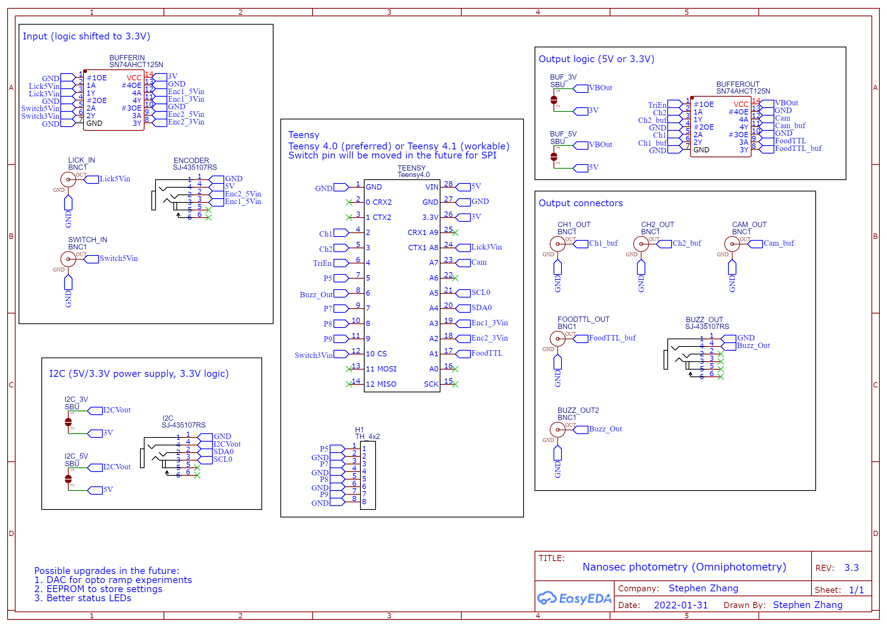

## Notes
* Max 3.3V output current is 250 mA.
* No pin is 5V tolerant!
* Possible upgrades: DAC, EEPROM, status LEDs, independent 3.3V regulator, coin cell holder for onboard RTC.

## Schematics

## Footprint

